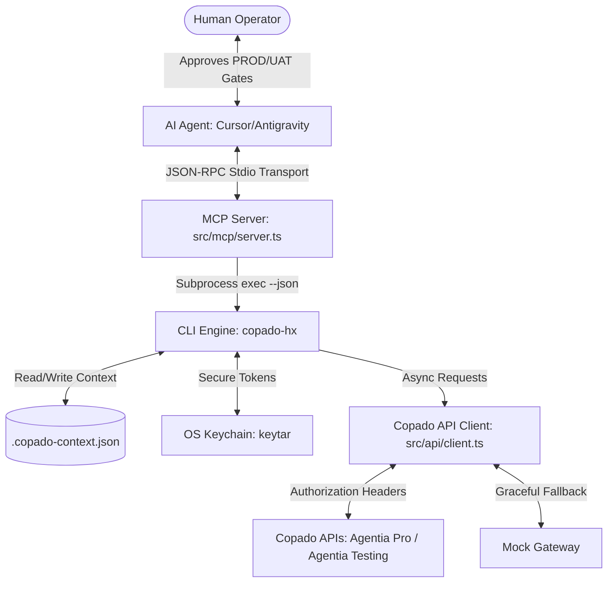

# 🚀 Copado Nexus

[](LICENSE)
[](tests/integration/integration/workflow.test.ts)
[](#)

**Copado Nexus** is a secure, browserless, enterprise-grade Salesforce DevOps orchestration layer designed to embed natively within AI-first IDE environments (such as Google Antigravity or Cursor). It bridges the gap between raw terminal execution and autonomous AI reasoning by seamlessly combining local state tracking, secure keychain storage, and a Model Context Protocol (MCP) server.

---

## 📋 Solution Abstract
Copado Nexus replaces manual clicking inside the Copado browser interface. Built on a robust Node.js and TypeScript architecture, it delivers a blazing-fast, state-aware terminal client (`copado-hx`) that caches local workspace context natively. 

Going beyond a standard CLI, it wraps the entire DevOps toolchain into a production-grade Model Context Protocol (MCP) server running over `stdio` transport. This enables LLM agents in Cursor, Claude, or Antigravity to understand and orchestrate multi-step Salesforce DevOps workflows—such as scanning Apex with the Build Agent, auto-generating test scripts via the Test Agent, and running robotic test executions—entirely headless. Crucially, it embeds hard-coded, non-negotiable human-in-the-loop guardrails for UAT and production deployments, ensuring autonomous operations remain enterprise-safe.

---

## 🏗️ The 3 Core Technical Pillars

Our architecture splits the DevOps lifecycle into three tightly integrated layers:



### 1. The Local Execution Layer: `copado-hx` CLI
A lightweight command-line interface running locally on the developer's machine:
*   **State-Aware Workspace**: Manages a hidden local `.copado-context.json` file to track variables like `userStoryId`, `pipelineId`, and `lastJobExecutionId`. Subsequent commands implicitly read this context, eliminating the need to type flags like `--id US-2026` repeatedly.
*   **Strict Security Compliance**: Outlaws plaintext credential configurations. It interacts directly with the system's native OS Keychain manager (via the `keytar` library) to securely handle platform tokens.
*   **Deterministic Errors**: Enforces validation checks, instantly returning clean error states if a developer attempts to execute unsupported operations.

### 2. The AI Communication Layer: The MCP Server
A native Model Context Protocol (MCP) server running over standard input/output (`stdio`) channels:
*   Maps underlying `copado-hx` subcommands into semantic JSON-RPC tool schemas (`copado_story_set`, `copado_commit`, `copado_test_run`, `copado_ai_ask`).
*   Integrates natively with LLM environments, giving the AI agent the capability to programmatically fire off your CLI tools on demand.

### 3. The Guardrails & Rules Layer: `SKILL.md`
The operational blueprint instructing the AI assistant on how to act as a reliable, safety-compliant DevOps co-pilot:
*   **Workflow Playbooks**: Step-by-step recipes dictating multi-agent handoffs—such as channeling metadata summaries from the Build Agent directly into custom test scripts via the Test Agent.
*   **Enterprise Approval Gates**: Hardcoded, non-negotiable instruction loop forcing the AI to halt completely and await manual written human confirmation before calling promotion or deployment routes targeting `UAT` or `Production`.

---

## ⚙️ Technical Stack & Brand Mappings

Copado Nexus utilizes the following developer tools and connects to these core platform APIs:

| Hackathon Resource | Project Service / Integration | Purpose |
| :--- | :--- | :--- |
| **Copado CI/CD API** | `Agentia Pro` | Handles stories, metadata commits, and environment promotions. |
| **Copado Robotic Testing Open API** | `Agentia Testing` | Triggers test jobs and evaluates quality gates. |
| **Copado AI Platform API** | `Agentia AI Context Hub` | Connects to specialist personas (Plan, Build, Test, Release, Operate). |
| **Model Context Protocol** | `@modelcontextprotocol/sdk` | Bridges AI-first IDE tools using JSON-RPC stdio transport. |
| **Node.js & TypeScript** | `npm` / `tsconfig.json` / `tsx` | Powers the core CLI and MCP server engines. |
| **Secure Token Storage** | `keytar` (OS Keychain wrapper) | Secures API tokens locally without configuration files. |

---

## 🛠️ CLI Commands Reference

### Authentication
*   `copado-hx auth login [--token <token>]`: Securely saves your Copado token in the OS Keychain.
*   `copado-hx auth status`: Returns current authentication status.
    *   *JSON Output:* `{ "authenticated": true, "user": "developer@copado.com" }`

### Story Context & Commits
*   `copado-hx story set --id <storyId>`: Configures and persists the active Salesforce User Story.
*   `copado-hx story show`: Displays active context parameters.
*   `copado-hx commit --message <message>`: Commits metadata changes scoped to the active story.

### Environment Promotion & Deployments
*   `copado-hx promote --env <env> [--validate] [--confirm]`: Promotes story to target environment.
*   `copado-hx deploy --env <env> [--confirm]`: Deploys story.
    *   *Note*: target environments equal to `UAT` or `PROD` require confirmation (interactive prompts, or `--confirm` under `CI=true` mode).

### Test Runs & AI Prompts
*   `copado-hx test run --job <jobId>`: Triggers a Copado Robotic Testing (CRT) job run.
*   `copado-hx ai ask --agent <agent> --prompt "<prompt>"`: Invokes one of the 5 specialized Copado AI Agents (`plan`, `build`, `test`, `release`, `operate`).
*   `copado-hx status [--watch]`: Evaluates the status of the last triggered deployment or test execution.

---

## 🔌 Stdio MCP Tools Schema

The MCP server exposes the CLI commands as semantic tools to the LLM agent:

| Tool Name | Input Schema (Arguments) | Description |
| :--- | :--- | :--- |
| `copado_story_set` | `{ "id": "string" }` | Activates a Salesforce User Story locally. |
| `copado_commit` | `{ "message": "string" }` | Commits changes for the currently active story. |
| `copado_test_run` | `{ "jobId": "string" }` | Triggers a Copado Robotic Test run. |
| `copado_ai_ask` | `{ "agent": "enum", "prompt": "string" }` | Submits prompt to a specialized AI agent. |

---

## 🚀 CopadoCon Presentation Guide (Live Workflow Demo)

To demonstrate the full DevOps lifecycle entirely browserless during the presentation, step through the following sequence in your terminal:

1.  **Log in and check credentials**
    ```bash
    npx tsx src/cli/index.ts auth login --token mock-token-123 --json
    npx tsx src/cli/index.ts auth status --json
    ```
2.  **Set active user story context**
    ```bash
    npx tsx src/cli/index.ts story set --id US-2026 --json
    ```
3.  **Ask Build Agent what changed**
    ```bash
    npx tsx src/cli/index.ts ai ask --agent build "What metadata files changed?" --json
    # Returns: ['LeadScoring.cls']
    ```
4.  **Ask Test Agent to generate a CRT script**
    ```bash
    npx tsx src/cli/index.ts ai ask --agent test "Generate a CRT script for LeadScoring.cls" --json
    # Returns Job ID: JOB-SMOKE-2026
    ```
5.  **Trigger the Robotic test execution**
    ```bash
    npx tsx src/cli/index.ts test run --job JOB-SMOKE-2026 --json
    ```
6.  **Evaluate status gates (Progressive simulation)**
    ```bash
    # Run status check commands sequentially:
    npx tsx src/cli/index.ts status --json   # Outputs: "In Progress"
    npx tsx src/cli/index.ts status --json   # Outputs: "In Progress"
    npx tsx src/cli/index.ts status --json   # Outputs: "Completed Successfully"
    ```
7.  **Trigger UAT validation (Gatekeepers block unless confirmed)**
    *   *Interactive prompt*:
        ```bash
        npx tsx src/cli/index.ts promote --env UAT --json
        # Prompts: Confirm promote (validation) to UAT? (y/N):
        ```
    *   *CI Bypass Mode*:
        ```bash
        # (Powershell)
        $env:CI="true"
        npx tsx src/cli/index.ts promote --env UAT --json              # Fails with HUMAN_APPROVAL_REQUIRED
        npx tsx src/cli/index.ts promote --env UAT --confirm --json    # Succeeds and initiates promotion
        ```

---

## 🔑 Real API Credentials vs. Mock Gateway

For live production integration, connect the CLI directly to the Copado platform by obtaining real credentials:
*   **Agentia Pro**: Sign up for a free Copado playground.
*   **Agentia AI Context Hub**: Sign up for a freemium Copado AI account.
*   **Agentia Testing**: Request a 30-day CRT trial account.

Save the credentials using:
```bash
copado-hx auth login --token <token>
```
The API connector client (`src/api/client.ts`) checks the OS Keychain and automatically attaches the token prefix (`Authorization: Bearer <token>`) on live network requests. If mock keys are active, the client gracefully falls back to the local simulated gateway responses, providing **zero-blocker offline speed** and **Wi-Fi Gate presentation safety**.

---

## 🧪 Development and Testing

### Setup
Install dependencies:
```bash
npm install
```

### Build CLI & Server
Compile TypeScript files:
```bash
npm run build
```

### Run Verification Tests
Verify all CLI logic, local state variables, polling transitions, and UAT safety checks using Vitest:
```bash
npm run test
```
