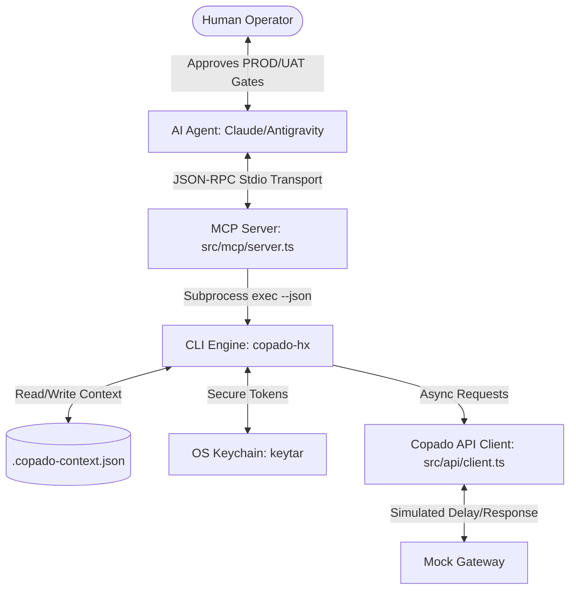

# Copado AutoPilot

[](LICENSE)
[](tests/integration/integration/workflow.test.ts)

**Copado AutoPilot** is a highly structured, enterprise-safe, browserless, and headless Salesforce DevOps orchestration platform built for the CopadoCON 2026 Hackathon. It packages a unified TypeScript CLI (`copado-hx`) wrapped entirely inside a native Model Context Protocol (MCP) server, allowing AI agents like Claude Desktop or Google Antigravity to run secure, state-aware Salesforce DevOps deployments and tests.

---

## 1. System Architecture



The system is composed of four decoupled layers:
1. **Core CLI Engine (`copado-hx`)**: commander-based CLI that reads/writes state locally.
2. **Copado API Connector**: Client interfaces mapping Copado CI/CD promotions, robotic testing, and AI specialist agent prompts.
3. **Native MCP Server Wrapper**: Connects the CLI tools to your AI agent environment via standard `stdio` transport.
4. **Playbooks & Guardrails**: Standardized workflow rules (`SKILL.md`) and built-in programmatic checks to enforce safety gates.

---

## 2. Key Features

- 🔑 **Secure Credentials**: Interacts with the OS Keychain securely via native `keytar` bindings for Token management.
- 📂 **State-Aware Workspace**: Keeps track of `userStoryId`, `pipelineId`, and `lastJobExecutionId` inside `.copado-context.json` to coordinate multi-step deployments.
- ⚙️ **Pure JSON Mode**: Every CLI command supports a `--json` flag to return machine-readable JSON payloads directly to standard output, suppressing logging noise.
- 🚨 **Production & UAT Guardrails**: Programmatically checks for `UAT` and `PROD` target environments. In non-interactive CI mode (`CI=true`), executions block and return `HUMAN_APPROVAL_REQUIRED` errors unless `--confirm` is provided. In interactive shells, it prompts the operator.
- 🔄 **Polling Status Transitions**: Tracks execution count on the status endpoint to simulate progressive task progression (`In Progress` -> `Completed Successfully`).

---

## 3. CLI Commands Reference

### Authentication Commands
* `copado-hx auth login [--token <token>]`: Securely saves your Copado API token in the OS Keychain.
* `copado-hx auth status`: Returns current authentication status.
  * *JSON Output:* `{ "authenticated": true, "user": "developer@copado.com" }`

### Story & Release Commands
* `copado-hx story set --id <storyId>`: Configures and persists the active Salesforce User Story.
* `copado-hx story show`: Displays the active context parameters.
* `copado-hx commit --message <message>`: Commits metadata changes scoped to the active story.
* `copado-hx promote --env <env> [--validate] [--confirm]`: Promotes the story to the target environment.
* `copado-hx deploy --env <env> [--confirm]`: Deploys the story (UAT/PROD require confirmation).

### Testing & AI Commands
* `copado-hx test run --job <jobId>`: Triggers a Copado Robotic Testing (CRT) run.
* `copado-hx ai ask --agent <agent> --prompt "<prompt>"`: Invokes one of the 5 specialized Copado AI Agents (`plan`, `build`, `test`, `release`, `operate`).
* `copado-hx status [--watch]`: Evaluates the status of the last triggered deployment or test execution.

---

## 4. Native MCP Server (JSON-RPC Tools)

The native Model Context Protocol (MCP) server exposes CLI workflows as semantic tools to your LLM assistant:

| Tool Name | Arguments | Description |
|-----------|-----------|-------------|
| `copado_story_set` | `id` (string) | Activates a story context locally. |
| `copado_commit` | `message` (string) | Commits changes for the active story. |
| `copado_test_run` | `jobId` (string) | Triggers a Copado Robotic Test. |
| `copado_ai_ask` | `agent`, `prompt` | Submits prompt to a specialist AI Agent. |

---

## 5. Development & Testing

### Installation
Install the project dependencies:
```bash
npm install
```

### Build CLI & Server
Compile TypeScript modules into production targets inside the `dist/` directory:
```bash
npm run build
```

### Run Integration Tests
Execute our comprehensive Vitest suite verifying the CLI commands, keychain storage, state tracking, and deployment safety gates:
```bash
npm run test
```
